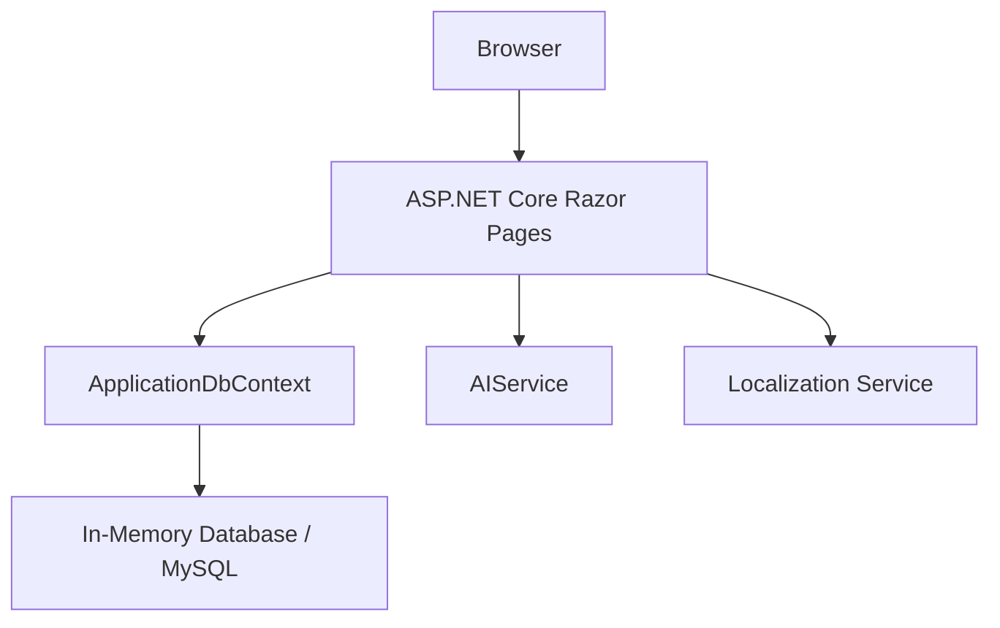
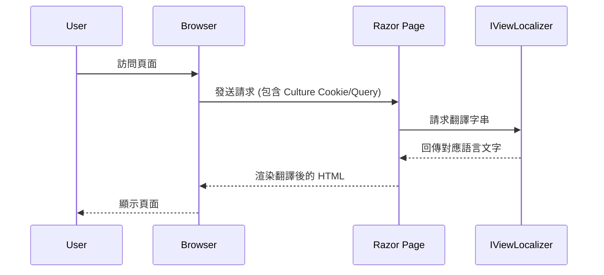

# DemoApi AI 會員管理系統

這是一個基於 .NET 8 Razor Pages 開發的 AI 會員管理系統範例，集成了櫻花升降機（Sakura Lift）的企業形象設計。

## 1. 架構與選型

## 2. 多語系建置流程

## 3. 功能特點
- 多語系支持 (繁體中文, English, 日本語)
- AI 驅動的會員管理介面
- 響應式企業形象網頁設計
- 符合 SOLID 設計原則的架構
