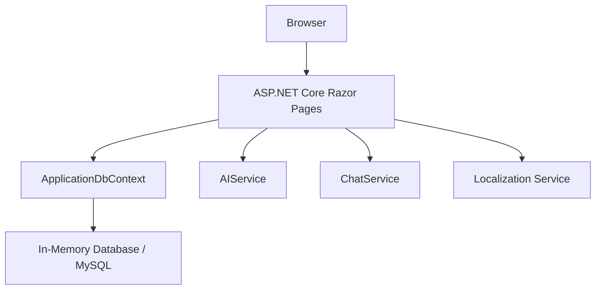
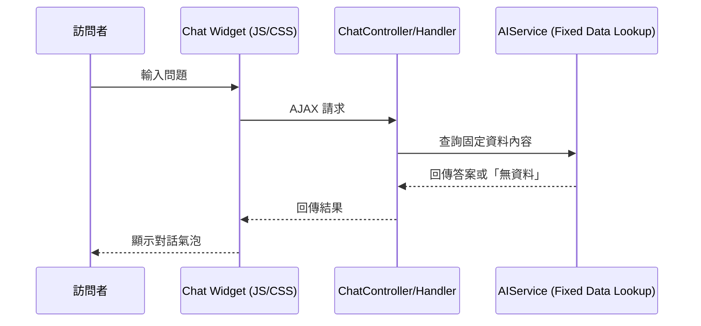

# DemoApi AI 會員管理系統

這是一個基於 .NET 8 Razor Pages 開發的 AI 會員管理系統範例，集成了櫻花升降機（Sakura Lift）的企業形象設計。

## 1. 架構與選型

## 2. AI 客服機器人流程

## 3. 功能特點
- **多語系支持**: 繁體中文, English, 日本語
- **AI 驅動的會員管理介面**: 自動化筆記建議與內容補全
- **AI 客服機器人**: 右下角懸浮按鈕，僅回答公司電話、地址等固定資訊，無效問題則回應「無資料」
- **響應式企業形象網頁設計**: 櫻花升降機品牌配色（紅、灰、白）
- **符合 SOLID 設計原則的架構**
- **單元測試**: 保證核心商業邏輯穩定性

## 4. 修復記錄
- **修復 Google SDK 引用**: 安裝了 `Google.GenerativeAI` NuGet 套件，解決 `Google` 命名空間找不到的問題。
- **補全 API 金鑰讀取**: 在 `AIService` 中正確讀取 `appsettings.json` 的 `AISettings:ApiKey` 配置。
- **資料移出至 Markdown**: 將原本在 `appsettings.json` 的 `CompanyInfo` 移出至 `Resources/CompanyInfo.md`，方便維護並提升 AI 讀取彈性。
